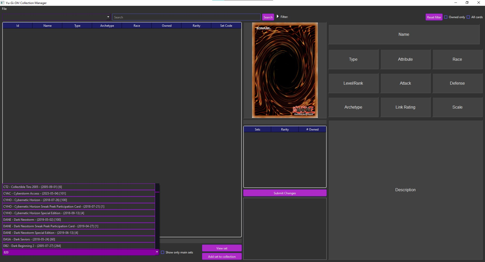
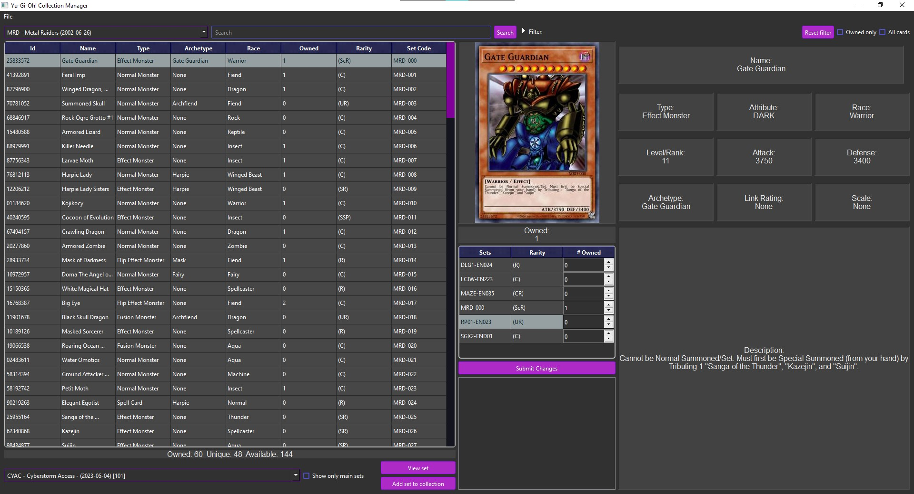
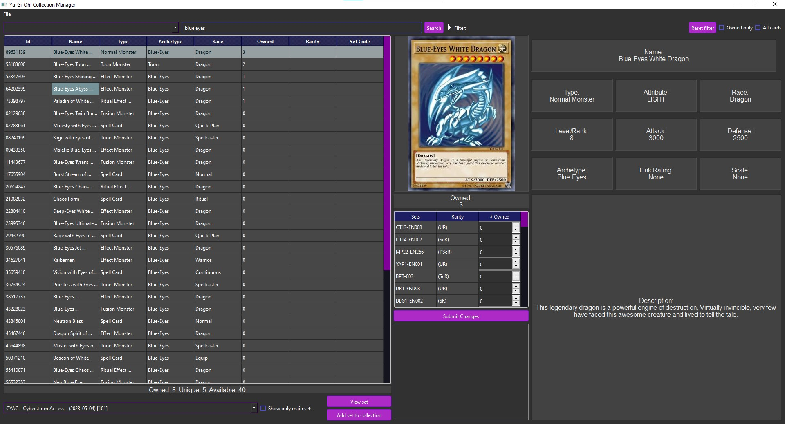
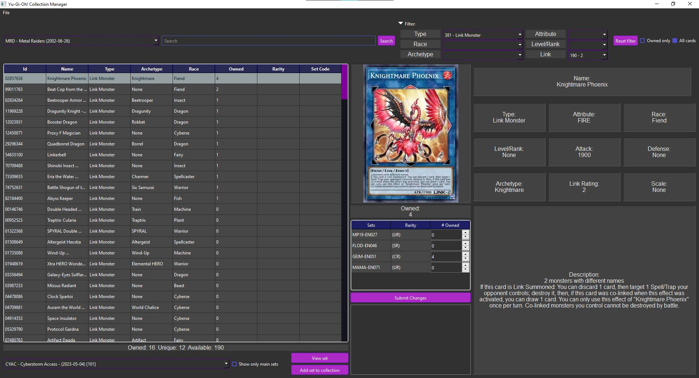
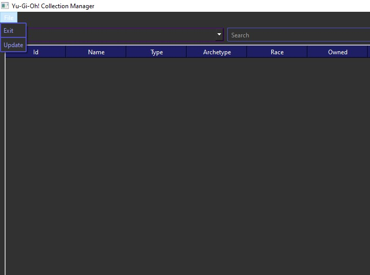

# YGO-Collection-Manager

A GUI tool to track your collection for the Yu-Gi-Oh! trading card game. Card information and artwork is
sourced using the [YGOPRODECK API](https://ygoprodeck.com/api-guide/).

## Installation

To install, clone the repository

```bash
git clone https://github.com/reboot20o/YGO-collection-manager.git
```

For dependencies, see `requirements.txt` in the assets directory.

## Usage

There are two versions of the application. One uses the Tk GUI library, while the other uses the Qt library.
It is recommended to use the version built using Qt as it looks and functions much better.

### Qt

To launch the application, simply run the executable in the `dist` folder. On first launch, the application will
create a folder in `AppData/Roaming` then initialize and populate the card database.
Since the application is bundled as a single executable, it may take a few seconds to launch.

### Tk

To use the Tk version of the application, you must first have a Python installation with packages listed in `requirements.txt`.
To start the application, run `src/tkinter/main.py`.

### Add to collection

To add cards to your collection, you must first select a 
set to add from the drop-down list located on the bottom left. 

This list contains every set 
printed for the TCG, including special editions and promotional cards. To filter the list, 
select the option *show only main sets*. After selecting the set to add, click the button 
*Add set to collection*.

After adding a set to the collection, the drop-down list on the top left will update. 
Selecting that set will populate the table with all the cards from that set.
Below the table, there is a summary that tells you how many cards from the set you own,
how many unique cards you own, and how many unique cards are available in the set.
Selecting a card from the table will populate the detailed card view on the right with the
associated card data.


To add a card to your collection, select the chosen card from the table, then using the spinboxes in the table below the card art,
you can change the number of owned copies based on set code. Then to confirm the changes, click the button *Submit changes*.
If the set containing a card you added was not already part of your collection, it will be added.

Using the search bar above the table, you can perform a fuzzy search to find particular cards based on card name.

You can further restrict your search by using the various filter options from the collapsible menu.

The filters will work in combination, though they may update slowly resulting in no matches.
Use the *Reset filter* button to reset the filter options.


If a set is missing cards or some set codes are incorrect, it may be an issue with data provided by the api.
First ensure your database is up to date by selecting *update* in the file menu.

If the issue persists, you can submit an issue, or simply wait and see if the problem fixes itself.

## Contributing
Pull requests are welcome. For major changes, please open an issue first to discuss what you 
would like to change.

Please make sure to update tests as appropriate.